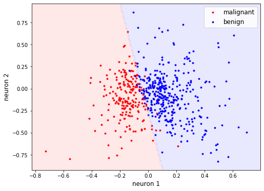

# Autoencoder
Autoencoder implementation in TensorFlow using the [Breast Cancer Wisconsin (Diagnostic) dataset](https://archive.ics.uci.edu/ml/datasets/Breast+Cancer+Wisconsin+(Diagnostic)).

<p align="center">
  
</p>

## Installation

To install the dependencies, run the following command:

```bash
pip install -r requirements.txt
```


## Usage

Open and execute the cells in `autoencoder.ipynb` from `notebooks/`. 

